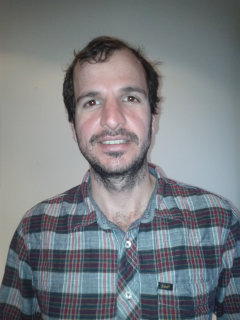

<head>
    <title>Francisco Sant'Anna</title>
    <meta http-equiv="Content-Type" content="text/html; charset=UTF-8"/>

</head>

# Francisco Sant'Anna ()

* Professor, [UERJ](http://www.uerj.br/idiomas.php#gb), Brazil
* PhD, PUC-Rio, Brazil.
* Computer Science --> Programming Languages --> Synchronous Reactive 
  Languages.
* Supervised by
    [Prof. Roberto Ierusalimschy](http://www.inf.puc-rio.br/~roberto)
    and
    [Prof. Noemi Rodriguez](http://www.inf.puc-rio.br/~noemi).
* List of publications: [bibtex](fsantanna.bib)

## Research

## Follow me

* Github:
    <http://github.com/fsantanna/>

* Twitter:
    <https://twitter.com/_fsantanna>

<!--
* Blog:
    <http://thesynchronousblog.wordpress.com/>
-->

## [Céu](http://ceu-lang.org)

Céu provides "Structured Synchronous Reactive Programming", a safe and 
deterministic concurrency model with side effects.
 
Reactive applications interact continuously with the environment and are mostly 
guided through input events from it.
 
Céu can be described as a reactive, imperative, concurrent, synchronous, and 
deterministic language.

<!--
Céu has a memory footprint of around 3Kb of ROM and 100b of RAM (on a 16bits 
platform).
-->

Website: <http://ceu-lang.org/> *(you can try Céu online!)*

Git project: <https://github.com/fsantanna/ceu/>

<!--
Currently, it is restricted to static-only applications.
I'm looking for embedded systems developers interested in using Céu.
I can help with all support (i.e. coding) to integrate Céu with your platform.
-->

### Publications:

* 2018
    - LCTES conference paper
        - **A Memory-Bounded, Deterministic and Terminating Semantics for the Synchronous Programming Language Céu**
        - formal semantics of Céu, proofs for termination, determinism, and memory boundedness
        - [ [pdf](ceu_lctes18_pre.pdf) | *to appear* ]
    - LCTES conference short paper
        - **Transparent Standby for Low-Power, Resource-Constrained Embedded Systems: A Programming Language-Based Approach**
        - interrupt service routines in Céu, power management, automatic standby
        - [ [pdf](ceu_lctes18_short_pre.pdf) | *to appear* ]

* 2017
    - TECS journal paper
        - **The Design and Implementation of the Synchronous Language Céu**
        - design and implementation of Céu, contrasting and comparing with Esterel
        - [ [pdf](ceu_tecs17_pre.pdf) | [site][tecs17_site] ]
        <!--* <small>**Recommended #4**</small>-->

* 2016
    - WebMedia conference paper
        - **Céu-Media: Local Inter-Media Synchronization Using Céu**
        - developing multimedia applications in Céu
        - [ [pdf](ceumedia_webmedia16_pre.pdf) | [site][ceumedia16_site] ]

* 2015
    - TOSN journal paper
        - **Terra: Flexibility and Safety in Wireless Sensor Networks**
        - tiny Céu virtual machine for dynamic reprogramming in constrained devices
        - [ [pdf](terra_tosn15_pre.pdf) | [site][tosn15_site] ]

    - REBLS workshop paper
        - **Reactive Traversal of Recursive Data Types**
        - tagged unions, the `traverse` construct, a logo turtle interpreter
        - [ [pdf](ceu_rebls15.pdf) | [site][rebls15_site] ]
        <!--* <small>**Recommended #3**</small>-->
    - Modularity conference paper
        - **Structured Synchronous Reactive Programming with Céu**
        - main paper about the "dynamic Céu": organisms, pointers and references
        - [ [pdf](ceu_mod15_pre.pdf) | [site][mod15_site] | [video][mod15_video] ]
        <!--* <small>**Recommended #2**</small>-->

* 2014
    - REBLS workshop paper
        - **Structured Reactive Programming with Céu**
        - supressed by Modularity'15 above
        - [ [pdf](ceu_rebls14_pre.pdf) | [site][rebls14_site] ]

* 2013
    - SenSys conference paper
        - **Safe Concurrent Abstractions for Wireless Sensor Networks**
        - main paper about the "static Céu": design, evaluation
        - [ [pdf](ceu_sensys13_pre.pdf) | [site][sensys13_site] ]
        <!--* <small>**Recommended #1**</small>-->
    - REM workshop paper
        - **Advanced Control Reactivity for Embedded Systems**
        - control mechanisms on top of Céu: exception handling, dataflow programming, the `par/hor` construct
        - [ [pdf](ceu_rem13_pre.pdf) | [site][rem13_site] ]
    - PhD. Thesis
        - **Safe System-level Concurrency on Resource-Constrained Nodes with Céu**
        - complete description of the "static Céu": design, evaluation, semantics, implementation
        - [ [pdf](ceu_phd.pdf) ]

* 2012
    - PUC-Rio technical report
        - **Céu: Embedded, Safe, and Reactive Programming**
        - supressed by the PhD. Thesis above (except for the sections on *asynchronous execution* and *simulation*)
        - [ [pdf](ceu_tr.pdf) | [site][tr_site] ]

* 2011
    - SenSys (Doctoral Colloquium) paper
        - **Céu: A Reactive Language for Wireless Sensor Networks**
        - first exposure of Céu, old expression-based syntax
        - [ [pdf](ceu_sensys11.pdf) | [site][dc_site] ]

[tecs17_site]:     https://dl.acm.org/citation.cfm?id=3035544
[ceumedia16_site]: http://dl.acm.org/citation.cfm?id=2976856
[tosn15_site]:     https://dl.acm.org/citation.cfm?id=2811267
[rebls15_site]:    http://www.guidosalvaneschi.com/REBLS/REBLS2015/
[mod15_site]:      http://www.aosd.net/2015/
[mod15_video]:     https://vimeo.com/110512582
[rebls14_site]:    http://www.guidosalvaneschi.com/REBLS/REBLS2014/
[sensys13_site]:   http://sensys.acm.org/2013/index.html
[rem13_site]:      http://soft.vub.ac.be/REM13/
[tr_site]:         http://bib-di.inf.puc-rio.br/techreports/2012.htm
[dc_site]:         http://www.cse.ust.hk/~lingu/SenSys11DC/

### Talks & Teaching:

* 2015: Curry-On!
    --- *"Mixing Control and Data Flow in Céu"*
    --- [ [site][curryon_site] | [video][curryon_video] ]

[curryon_site]: http://curry-on.org/
[curryon_video]: https://www.youtube.com/watch?v=aivVg9WMuMs

* 2014: Strange Loop / Emerging Languages Camp / Future of Programming Workshop 
    --- *"Dynamic Organisms in Céu"*
    --- [ [site][fpw_site] | [video][fpw_video] ]

[fpw_site]: http://www.future-programming.org/program.html
[fpw_video]: https://vimeo.com/110512582

* 2014: PUC-Rio / Undergraduate course
    --- *"Sistemas Reativos"*
    --- [ [github][reativos_github] ]

[reativos_github]: https://github.com/fsantanna/reativos/

* 2011-2012: [ORT](http://www.ort.org.br) and [UFRJ](http://www.ufrj.br)
    --- *"Programming Wireless Sensor Networks"*

## [LuaGravity][luagravity]

[luagravity]: https://github.com/fsantanna/luagravity/

LuaGravity is a reactive language that implements the synchronous approach for 
concurrency.
It is based on Esterel and FrTime, two synchronous reactive languages, 
the former having an imperative style, the latter being functional.
LuaGravity is implemented as a set of runtime extensions to the Lua language.  

<!--
For an introductory video about LuaGravity, [click 
here](http://thesynchronousblog.wordpress.com/lua-workshop09-video/).

I have developed LuaGravity during my MSc and currently maintain it.

See [Reactive Server Pages (RSP)][rsp], a project that brings the concepts of 
LuaGravity to the realm of server-side web development.

[rsp]: http://www.lua.inf.puc-rio.br/~francisco/rsp/
-->

### Publications:

* 2009: SBLP conference paper
    --- *"LuaGravity: a Reactive Language based on Implicit Invocation"*
    --- [ [pdf](luagravity_sblp.pdf) ]

* 2009: MSc dissertation
    --- *"A Synchronous Reactive Language based on Implicit Invocation"*
    --- [ [pdf](luagravity_msc.pdf) ]

### Talks:

* 2009: Lua Workshop
    --- *"LuaGravity: A reactive language"*
    --- [ [slides][luagravity_luaws_video] | [video][luagravity_luaws_video] | [site][luagravity_luaws_site] ]

[luagravity_luaws_slides]: http://thesynchronousblog.files.wordpress.com/2009/11/gvt_luaws.pdf
[luagravity_luaws_video]: https://www.youtube.com/watch?v=6XMbQ3xjkzI
[luagravity_luaws_site]: http://www.lua.org/wshop09.html

## [NCL](http://www.ncl.org.br) / [NCLua][nclua]

[nclua]: http://www.telemidia.puc-rio.br/~francisco/nclua/

NCL is declarative language that provides several facilities for authoring a 
complete hypermedia document with synchronization relationships among its 
components.
NCL is used on Brazilian Digital TV middleware 
[Ginga](http://www.ginga.org.br).

NCL was created by Prof. Luiz Fernando Gomes Soares, and is maintained by the 
[TeleMidia Laboratory](http://www.telemidia.puc-rio.br) at PUC-Rio.

NCL is scriptable in Lua through the so called NCLua objects.

I have created the NCLua specification with [Prof. Renato 
Cerqueira](http://www.inf.puc-rio.br/~rcerq) and Prof. Luiz Fernando Gomes 
Soares, and have implemented the first public release.

### Publications:

* 2009: DocEng conference paper
    --- *"Relating Objects with Imperative Code and Objects with
          Declarative Code through NCL Glue Language"*
    --- [ [pdf](nclua_doceng.pdf) | [site][nclua_doceng] ]

* 2009: Book chapter
    --- *"Programando com Objetos NCLua (Programando em NCL 3.0)"*
    --- [ [site][nclua_book] ]

* 2009: Webmedia short course (book chapter)
    --- *"Desenvolvimento de Aplicações Declarativas para TV Digital no 
          Middleware Ginga com Objetos Imperativos Lua"*
    --- [ [pdf](nclua_shortcourse.pdf) | [site][nclua_shortcourse] ]

* 2008: Webmedia conference paper
    --- *"NCLua - Objetos Imperativos Lua na Linguagem Declarativa NCL"*
    --- [ [slides](nclua_webmedia_slides.pdf) | [pdf](nclua_webmedia.pdf) | [site][nclua_webmedia] ]

* 2008: Norma ABNT
    --- *"Digital terrestrial television, Data coding and transmission
         specification for digital broadcasting, Part 2: Ginga-NCL for
         fixed and mobile receivers, XML application language for
         application coding"*
    --- [ [site][nclua_abnt] ]

[nclua_doceng]: http://doceng09.cs.unibw.de/
[nclua_book]: http://www.elsevier.com.br/site/produtos/Detalhe-Produto.aspx?tid=3826&seg=6&isbn=9788535234572
[nclua_shortcourse]: http://www.sbc.org.br/ce-webmedia/webmedia2009/
[nclua_webmedia]: http://www.inf.ufes.br/webmedia2008/webmedia2008_home.html
[nclua_abnt]: http://www.forumsbtvd.org.br/

### Talks & Teaching:

* 2008-2011: PUC-Rio/CCE postgraduate
    --- *"Desenvolvimento de Aplicações e Conteúdo para TV Digital em Ginga-NCL"*
    --- [ [site][nclua_cce] ]

* 2009: Lua Workshop
    --- *"Aplicações interativas para a TV digital brasileira"*
    --- [ [slides](nclua_luaws.pdf) | [video][nclua_luaws_video] | [site][nclua_luaws_site] ]

[nclua_cce]: http://www.cce.puc-rio.br/informatica/tvdigital.htm
[nclua_luaws_video]: mms://midia.com.puc-rio.br/integra/20091109_lua2tarde1.wmv
[nclua_luaws_site]: http://www.lua.org/wshop09.html

 

<!--

## [Lua](http://www.lua.org)

Lua is a powerful, fast, lightweight, embeddable scripting language.

Lua combines simple procedural syntax with powerful data description constructs 
based on associative arrays and extensible semantics.
Lua is dynamically typed, runs by interpreting bytecode for a register-based 
virtual machine, and has automatic memory management with incremental garbage 
collection, making it ideal for configuration, scripting, and rapid 
prototyping.

The Lua language is designed, implemented, and maintained at PUC-Rio by Profs. 
[Roberto Ierusalismchy](http://www.inf.puc-rio.br/~roberto/), [Waldemar 
Celes](http://www.inf.puc-rio.br/~celes/), and [Luiz Henrique de 
Figueiredo](http://www.tecgraf.puc-rio.br/~lhf/).

Most of my researching and teaching is related to the Lua language.

### Talks & Teaching:

* 2010-2012: [ORT](http://www.ort.org.br)
    --- *"Programação em Lua"*

* 2010: JAI short course
    --- *"Introdução à Linguagem Lua"*
    --- [ [site][lua_unicentro] ]

* 2010: ERBASE short course
    --- *"Programação na Linguagem Lua"*
    --- [ [site][lua_erbase] ]

[lua_unicentro]: http://eventos.unicentro.br/jai2010/
[lua_erbase]: http://www.fejal.com.br/erbase2010/index.php
-->

                       
                       

